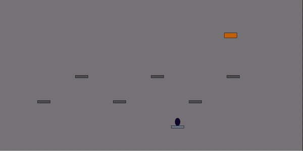

**<h1 align="center">Brick Breaker</h1>**

A variant of the traditional Brick Breaker game where players shoot at moving brick targets with score tracking. Brick Breaker is implemeneted in Java and deployed via Java Applet. 

# How to play
Destroy all the targets before they reach the bottom of the screen!  
## Controls
  
- **Tap/Hold** ***LEFT*** arrow to move the Bullet and Bullet Base left with a speed greater than the speed of the brick targets. 
- **Tap/Hold** ***RIGHT*** arrow to move the Bullet and Bullet Base right with a speed greater than the speed of the brick targets. 
- **Tap** ***UP*** arrow  to shoot one bullet.  
  **Hold** ***UP*** arrow to shoot a continuous stream of bullets.  

## Score
  

After player has successfully destroyed all targets, game score is displayed. SCore is calculated in two ways
1. If a bullet hits the current Bottom or Sides of the bricks, each destroyed brick increments score by 1 point
2. If a bullet hits the current Top section of the bricks by bouncing off the top of the screen onto the bricks, each destroyed brick increments score by 2 points.  

I included this feature because I wanted a way to make the game more fun by a high score that is achived not just by destoying the targets, but with skill and most importantly, fun!

## Restart
Can you beat your high score?!  
  

After a player has successfully destroyed all bricks, their score is displayed with an option to "Play Again?"
- **OK** calls a reset function within the code that:  
&nbsp;&nbsp;&nbsp;&nbsp;&nbsp;&nbsp;1. Resets running score varaible to 0  
&nbsp;&nbsp;&nbsp;&nbsp;&nbsp;&nbsp;2. Deletes all game entities, repaints the Applet and position all game entities to their starting positions.  
&nbsp;&nbsp;&nbsp;&nbsp;&nbsp;&nbsp;3. Restarts Applet for another round of Brick Breaker!  
- **NO** terminates running code and exits Java Applet. 
    
## Safegurards
  
- **Left/Right Bounds:** Restricts player movements beyond screen bounds by tracking user inputs and determining if move is safe to execute.  
- **Top/Bottom Bounds:** Bullet can bounce back from the top of screen, allowing users to rack up double the points by destroying a brick in that fashion. Continuous position tracking of bullet replaces it on base if it goes past the bottom of the screen. 
- **Barriers** 6 barriers forces player to shoot around them. If a bullet collides with a barrier, the bullet richochets back. 

# About the project 

# Future scope
test
